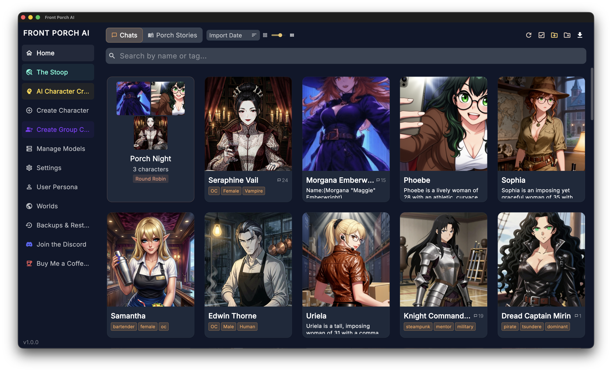

# User Guide

The complete reference for Front Porch AI — every feature, explained in plain English.

This guide assumes the app is installed and an AI model is set up. If you're not there yet, start with the [Getting Started guide](getting-started.md) and the [Installation guide](install.md).

It describes **Front Porch AI 1.2 ("Occupy Mars")**. A few things noted below need 1.2 or newer — where that matters, it says so.

> **Tip:** Many actions have hotkeys — see [Keyboard Shortcuts](keyboard-shortcuts.md).

---

## Table of Contents

**Everyday chatting**
- [The Chat Screen](#the-chat-screen)
- [Message Tools](#message-tools)
- [Director Mode](#director-mode)

**Your characters & their world**
- [Characters](#characters)
- [User Personas](#user-personas)
- [Lorebooks & Worlds](#lorebooks--worlds)
- [Group Chats](#group-chats)
- [The Realism Engine](#the-realism-engine)
- [Long-Term Memory](#long-term-memory)

**Voice, images & stories**
- [Voice: Talking and Listening](#voice-talking-and-listening)
- [Image Generation](#image-generation)
- [Porch Stories (Novel Generator)](#porch-stories-novel-generator)

**Beyond the desktop**
- [The Stoop (Community Hub)](#the-stoop-community-hub)
- [Web & Phone Access](#web--phone-access)

**Settings & upkeep**
- [Generation Settings](#generation-settings)
- [Appearance](#appearance)
- [The AI Backend](#the-ai-backend)
- [Backups & Data Safety](#backups--data-safety)
- [Updates](#updates)
- [Getting Help](#getting-help)

---

## The Chat Screen

Click any character on the home screen and you're in a chat.

**What you're looking at:**

- **Top bar** — the character's avatar, name, and a short description. The back arrow returns you to your library, and the **Toggle Sidebar** button on the right opens or closes the right-hand sidebar. That's all the top bar holds.
- **The conversation** — your messages and the character's replies, on top of a scene background you can change (see [Appearance](#appearance)). If Character Expressions are enabled, the character's portrait changes as their mood changes.
- **Right sidebar** — **Main Settings** sits at the top of the sidebar (not the top bar), opening a menu with Edit Character, Avatar Gallery, UI Settings, Chat Settings, Model Settings and TTS Settings. Because it lives in the sidebar, you need the sidebar open to reach it. Below it are collapsible cards you can open and close independently: **📝 Author's Note**, **🎭 Character State** (mood, bond/trust bars, needs, scene clock, weather, ambitions), **📖 Journal & Memory**, **🎯 Objectives**, and **🎲 Story Tools** (Chaos Mode, Dynamic Responses, Places, lorebooks). A one-on-one chat shows all five; a group chat shows four, because group objectives open from the focused cast member's card instead of getting a card of their own. If the participant you have focused is a lightweight **scene guest** (see [Group Chats](#group-chats)), Character State and Objectives drop away as well — a guest carries no relationship or needs tracking, and a small "Lite NPC" note in the sidebar says so.
- **Input bar** — the strip along the bottom: your persona avatar and a row of buttons, the box you type in, and more buttons after it. Drag the grip to make the box taller. **Enter** sends; **Shift + Enter** makes a new line.

**Sending a message:** type and press Enter. The reply streams in live, word by word — no waiting for the whole thing. A red **Stop** button appears while the AI is writing; click it any time to cut the reply short.

**Attaching a photo:** the **Attach a photo** button next to the message box adds an image to your message. If your model can see images, it looks at the photo directly. If it can't, the app offers a small offline **Photo Understanding** helper that describes the picture for it, so the character can still react. (Once installed, you can remove it again from Settings → Voice & Media.)

**Slash commands:** type `/` in the message box and a list of commands appears above it — tap one to fill it in. They cover bringing characters in and out of a scene, forcing a turn, setting turn order, generating an image, and stepping away. See [Group Chats](#group-chats) for the cast commands.

**Chat Management** (the folder icon in the input bar at the bottom of the chat — not in the top bar) holds **New Chat**, **Chat History** (every past conversation with this character), **Import Chat** / **Export Chat** (SillyTavern-format JSON, so conversations move between apps), **Context Budget** (see [Long-Term Memory](#long-term-memory)), and **Turn Into a Story…**, which hands the conversation to [Porch Stories](#porch-stories-novel-generator). Right-click a character or group on Home → **Chat History** opens the same list (edit name, delete a chat); it does not delete the character.

**Thinking models:** some AI models (like Qwen or DeepSeek) "think out loud" before answering. Front Porch tucks that private reasoning into a collapsible "Thought" chip above the reply — tap it if you're curious, ignore it if you're not.

---

## Message Tools

Messages come with their own controls, and they're always on screen — there's nothing to hover over to reveal them. **Edit**, **Fork from here** and delete sit on every message. **Regenerate**, **Continue** and the ◀ ▶ swipe arrows appear on the last reply. (The one exception below is Impersonate, which is the magic-wand button in the input bar rather than anything on a message — it's grouped here because it belongs with the rest.)

### Regenerate & Swipes

Didn't like the reply? **Regenerate** asks for a completely new one — and the old version isn't thrown away. Each alternative is saved as a **swipe**. When a message has more than one version, ◀ ▶ arrows appear so you can flip between them instantly and keep whichever you like best.

### Continue

Tells the AI "keep going" from where the reply left off. Handy when a response got cut short or you want a longer scene.

### Impersonate

The magic-wand button in the input bar at the bottom — not on a message bubble — asks the AI to write *your* next message for you. You can type a few words in the box first to steer it. Great for when you're stuck.

### Edit

The pencil (**Edit message**) on any bubble — yours or the character's — lets you rewrite it. The story continues from your edited version, a clean way to fix small details without restarting. **Esc** cancels (asking first if you changed anything), **Ctrl/⌘ + Enter** saves.

### Delete

Deleting a message removes that whole turn — and it also **rolls back any Realism Engine changes** that message caused. If a reply tanked your character's trust, deleting it undoes the damage too.

### Suggest Actions

The lightbulb button asks the AI for four short, clickable ideas for what you could do next ("Ask about their day", "Suggest moving somewhere private"…). Click one and it's sent as your message. Perfect for keeping momentum when you're not sure what to say.

### Branching

**Fork from here** on any bubble splits the chat at that point so you can explore a "what if" storyline, leaving the original untouched.

---

## Director Mode

Director Mode turns you from a participant into the director of the scene. Characters respond to each other on their own — you sit back and steer. It's a **group chat** feature.

- Toggle it at the top of a group chat's sidebar (you can also have a group start in Director Mode by default). The input bar changes to **"Direct the scene..."** — anything you type becomes a stage direction rather than dialogue ("Suddenly the power goes out", "Time skip to the next morning").
- A **Response Delay** slider controls the pacing between turns, so a scene unfolds at reading speed instead of all at once.
- A play/pause button in the chat toolbar starts and stops hands-free auto-chat; outside of that, the **next character** button triggers one turn at a time.

Pair Director Mode with auto-playing voice and Character Expressions and you get something close to ambient theater — characters talking, portraits shifting with their moods, while you drop in a note whenever you want the story to turn.

---

## Characters

Your library lives on the home screen. For everything about creating, importing, and editing characters — including the AI Quick Create wizard and card format details — see the dedicated [Characters guide](characters.md). Here's the short version.

- **Create** — build a character by hand with the step-by-step creator, or type a one-line concept and let the AI write the whole card (personality, first message, example dialogue, even a matching avatar).
- **Import** — the download button in the toolbar takes **Import Cards** (character card PNGs and JSON), **Import Folder** (a whole directory at once), and **Import Backyard AI (.byaf)** archives. For browsing and downloading new characters without leaving the app, use [The Stoop](#the-stoop-community-hub).
- **Edit** — open any card to change its personality, greetings, example dialogue, voice, lorebooks, and Realism Engine starting values.
- **Avatar Gallery** — from a chat's **Main Settings → Avatar Gallery**, give a character several looks plus their expression images, star a canonical avatar, and pick which look this particular chat uses.

**Staying organized:**

- **Folders** — enter Organize mode from the toolbar ("Organize into folders"), select characters, and move them into folders; you can also drag a card straight onto a folder. Folders nest, and breadcrumbs help you navigate. **Since 1.2, group chats can live in folders too** — drag them, or grab them in a multi-select and use **Move to folder** alongside characters.
- **Tags** — label characters freely and filter by tag in search.
- **Search** — the search bar matches names and descriptions, and you can scope it to the current folder, that folder plus subfolders, or your whole library.
- **Sort** — Name (A→Z), Recent Activity, Import Date, or Messages Sent.
- **Zoom** — a grid slider makes cards bigger or smaller to suit your collection.

---

## User Personas

A persona is *you* — who the character thinks they're talking to. Open **User Persona** in the left sidebar.

Each persona has:

- **Avatar** — the picture used for your messages.
- **Title** — an optional label just so you can tell personas apart in the list.
- **Name** — what gets sent to the AI as your name.
- **Persona text** — the details the character knows about you. This is included in every conversation, so keep it tight.

You can keep as many personas as you like and switch which one is **active**; the active persona is the one used in chats. Personas import and export as JSON, and personas brought over from SillyTavern or Backyard AI fill themselves in automatically.

---

## Lorebooks & Worlds

Lorebooks are how you give a character knowledge that never gets forgotten — backstory, places, factions, rules of magic, anything the AI should know but that would bloat every message if you pasted it in.

**How they work:** each lorebook entry has trigger keywords and a chunk of text. When a keyword shows up in recent conversation, that entry's text is quietly slipped into what the AI reads before replying. Mention "the war", and the AI suddenly knows your world's history of it.

**Making entries:** open a chat's sidebar → **Story Tools** and expand the lorebook section, or manage them from the character editor. Each entry gets:

- **Keywords** — the words that wake it up (optionally regex, optionally case-sensitive)
- **Content** — what the AI learns when triggered
- **Always Active** — some entries can be marked constant so they're *always* in play

And, if you want them, the finer controls SillyTavern users will recognize:

- **Secondary keywords** with AND/NOT logic, so an entry only fires in the right combination
- **Position and Order** — where the text lands in the prompt and which entries win when space is tight, plus an "ignore token budget" escape hatch for entries that must always make it
- **Scan depth** — how far back in the conversation the app looks for keywords
- **Sticky, Cooldown and Delay** — stay active for N messages, refuse to re-fire for N messages, or stay silent until the chat is long enough
- **Probability and groups** — random firing, and groups where only one entry of the set is picked
- **Chain reactions** — let one entry's text trigger another

Entries that are currently active are highlighted, and the sidebar shows what *would* trigger next, so you always know what the AI can "see."

**Worlds** are the **Places** your stories happen in — open **Worlds** in the left sidebar. A place bundles lore (so every character who lives there knows its geography, politics and history), optional cover art, and a **climate**. Attach a place to a chat from the sidebar's **Story Tools → Places** panel. Lorebook and world files from SillyTavern import cleanly.

**Rule of thumb:** character-specific facts go in the character's own lorebook; shared setting lore goes in a Place.

### Weather and climate

A place gives its chats real, consistent weather. There are built-in climates (temperate, rainforest, desert, continental, tropical, mediterranean, highland), each with its own seasons, conditions and temperatures. The current condition and temperature show as a chip in the chat sidebar, and the character actually notices them — nobody sunbathes in a blizzard. Temperatures follow the °C/°F setting in Settings → General.

**Authoring your own climate (1.2):** the climate editor lets you build a world that isn't Earth.

- **Seasons and temperatures** — set the temperature band and swing for each of the four seasons, from cryogenic all the way up to inferno.
- **Renamed conditions** — call "rain" a *Dust Squall* and give it your own emoji. Each rename carries a **stance** (pleasant, ordinary, harsh, dangerous, deadly) so the app knows how characters should treat it — nobody goes dancing in acid rain.
- **How often each condition happens** — weight the mix per season.

**Atmosphere and gravity (1.2):** a place can also declare that its air is thin, unbreathable or outright hostile, and that gravity is low, high or micro. Characters behave accordingly — they struggle for breath, move differently, and treat going outside as the serious thing it is. Leave both at the Earth-normal default and nothing is added to the story at all.

### Sharing places

Places export to a portable **`.fpworld`** file (lore, climate, traits and cover art in one package) and import the same way from the Worlds page. You can also **share a place on [The Stoop](#the-stoop-community-hub)**, and downloading one drops it straight into your Places — no file handling at all.

> Places themselves aren't new — they've been in the app since 1.0, and so have the built-in climates. What arrived in 1.2 is the authored-climate editor above (including atmosphere and gravity) and the portable `.fpworld` package here. A `.fpworld` file needs **Front Porch AI 1.2 or newer**; an older version can't open one.

---

## Group Chats

Put two or more characters in one room and they'll talk to you *and each other* — each with their own personality, voice, expressions, and Realism Engine state.

**Creating a group:** click **Create Group Chat** in the left sidebar. It's a step-by-step wizard: build a roster of at least two characters, give the group a name, an opening scenario and first message (the AI can draft both for you), and choose how turns work.

**Turn order** comes in two flavors:

- **Round robin** — characters speak in a fixed rotation.
- **Random** — anyone might speak next.

Outside of full auto-play, a **next character** button in the toolbar shows who's up and lets you trigger their turn — or hand the reins over entirely with Director Mode and auto-advance.

Each member keeps their own lorebooks, relationship scores, needs, expression images, and voice. It's a real ensemble, not one AI wearing different name tags.

Groups sit on the home screen next to your characters, and (since 1.2) can be filed into folders the same way.

### A cast that changes mid-story

A 1:1 chat and a group are the same chat with a different headcount — so you can change the cast **in place**, with your history and every character's memory and relationships intact. Type `/` in the message box to see the list; the ones that move people around are:

- **`/join <name>`** — bring someone into the scene. In a 1:1 they arrive as a lightweight **scene guest** (they're in the story, but they don't carry their own relationship and needs tracking). In a group, everyone is always a full member.
- **`/join --full <name>`** — bring someone in as a *full* member. In a solo chat that converts it into a group on the spot, no wizard and no screen change. The newcomer makes an entrance in their own voice and the story just continues.
- **`/promote`** — turn the scene you're already in into a real group, upgrading every guest present to a full member.
- **`/exit <name>`** — write someone out. They get a goodbye, and a one-tap **Undo** appears in case you regret it.
- **`/speak <name>`** — make a specific character take a turn right now.
- **`/turnorder`** — set exactly who speaks when, including your own slot (`/turnorder Mara, {{user}}, Kai`). On its own, it shows the current order.
- **`/create <name>: <concept>`** — invent a brand-new guest on the spot and walk them into the scene.
- **`/scan`** — look over the scene for someone the story keeps mentioning and offer to add them.

When a group shrinks back to one character, it collapses into a clean 1:1 with the original character — no leftover copies — and they remember everything that happened in the group.

**Other commands worth knowing:** `/image` pictures the current scene (or whatever you describe), `/expression` sets a character's portrait by hand, and `/afk` keeps the scene ticking over while you step away.

---

## The Realism Engine

The feature that makes characters feel alive instead of stateless. When it's on, the app quietly evaluates each exchange and updates what the character feels:

- **Bond** — closeness, running from −300 to +300. Earned slowly; lost fast.
- **Trust** — how safe you seem, on a smaller −100 to +100 scale.
- **Emotion** — a current mood with momentum. Small moments cause small drift; it takes something real to swing a mood hard.
- **Arousal** — a −100 to +100 scale with its own pacing and recovery, for stories with 18+ themes.
- **Time** — the story clock moves **every single turn**, by however long the exchange actually took, and rolls over into days, weekdays and seasons. You can nudge it with the ‹ › chevrons in the sidebar or skip ahead by writing something like *(OOC: we drive for several hours)*.
- **Weather** — each chat gets consistent, believable weather (with real temperatures) from the Place it's set in, and the character reacts to it. See [Lorebooks & Worlds](#lorebooks--worlds).
- **Needs** — a Sims-style layer: hunger, bladder, energy, social, fun, hygiene, comfort — each drifting realistically and coloring the character's behavior.
- **Fixations, objectives & ambitions** — characters can develop obsessions, pursue goals of their own, and carry longer-term ambitions that inch forward over many sessions.
- **Growth Rings** — instead of rewriting a personality, long stories add *rings*: new stances, habits, skills and scars that layer on top of who the character already was. You can review them in the sidebar.
- **Promises** — commitments either of you make are tracked. Kept ones warm trust; broken ones hurt; open ones hang over the next reply.
- **Dreams** — when a story night passes, the character dreams: a short, hazy scene made from what they remember, how they feel, and the weather outside.
- **Chaos Mode** — optional random "Chance Time" events that shake up the scene when things get too comfortable.

Everything shows up in the chat sidebar under **Character State** — relationship bars, current mood, needs, the scene clock, the weather chip, ambitions — and small chips under each reply show what changed and why.

You can switch the engine (or individual parts of it) on and off globally in Settings and per character in the editor. For a single conversation: in a one-on-one chat the switch sits on the **Character State** card in the sidebar; in a group chat that card has no such switch — use **Group Settings → Realism**, which has a "Realism Engine for this group" toggle. (The tune icon on the Character State card opens the finer simulation settings in both.)

**The full deep-dive — every system, number, and tuning knob — lives in the [Realism Engine guide](realism-engine.md).**

---

## Long-Term Memory

Front Porch gives characters real long-term memory, entirely on your machine — no cloud. It comes in two layers, both under **📖 Journal & Memory** in the chat sidebar.

### The Journal

Every so often the character writes in a diary. Not a bland summary — **memory cards**, each one a thing that happened *and how it felt*, stamped with the emotion and how strongly they felt it.

- **Warm memories stay close.** Cards carry heat that cools a little each time the diary is updated. Recent, intense ones are always in mind; quiet ones fade into the back of the drawer. Something big — a promise broken, trust repaired, a goal finally reached — makes them stop and write immediately.
- **Bringing a cold memory back** needs the Memory (RAG) layer below: matching a faded card to what you just said is done with the same small embedding model, so it only happens once RAG is switched on *and* that model has been downloaded. On a fresh install neither is true yet, so faded cards simply stay faded — everything else about the diary works regardless, warm and pinned cards included.
- **"Where we are"** — a short running recap of the situation, at the top of the section.
- **Our Story** — open the full diary and switch to the **Our Story** tab for the relationship's real beats: first bond tier reached, trust repaired, promises kept and broken, objectives completed. Every entry quotes the line it came from, and tapping it jumps you back to that exact message.
- **You can write in it too.** **Plant a memory** adds a card in your own words; you can edit, pin (pinned cards never fade) or delete anything the character wrote.
- **Review updates first** — an optional switch behind the sliders icon on the "Where we are" card. Proposed diary changes wait for your approval instead of saving themselves. (There's also a control for how often the diary updates, and a pause button.)

**Memories never leak between chats.** A character's diary belongs to the conversation it was written in, and it's deleted with that chat. Two separate chats with the same character know nothing about each other — deliberately.

The Journal has its own on/off switch, next to the "Where we are" heading in the sidebar. Turn it off and both the diary and the recap stop — the character then only remembers what still fits in the context window, plus whatever the Memory layer below finds.

### Memory (RAG)

The second layer is a searchable index of the conversation itself. As you chat, the app converts stretches of conversation into compact "memory fingerprints" using a small local AI model (you'll be offered a quick one-time download when you first enable it). When the character replies, the app finds the most relevant old passages from earlier in *this* conversation — the parts that have already scrolled out of the AI's working memory — and slips them back into what the AI reads.

**This layer respects the same wall the diary does.** A character's own memories are searched only within the chat they were made in; anything belonging to a different conversation with them is deliberately skipped, so an old storyline can't bleed into a new one. The only two things that reach across conversations are ones you set up yourself: the opt-in **Sources** list and the **Data Bank**, both described just below.

The **Memory (RAG)** panel lets you set how many memories to pull per turn, open the **Data Bank** (reference material you write yourself for a character to draw on), and pick **Sources** — an opt-in list if you *want* a character to also draw on memories belonging to *other* characters. Nothing crosses over unless you tick it.

Memory (RAG) has a master switch that is off until you turn it on and download the embedding model. Once it is on, group chats use it too and are enabled by default; the sidebar Memory (RAG) panel itself only appears in one-on-one chats, and groups are configured under **Group Settings → Memory & RAG**: turn it on or off for the group, set how many memories to pull, set how much of the context budget they may take, and boost or suppress each individual member with **Per-Character Memory Importance**.

### Seeing what the AI was actually told

**Chat Management → Context Budget** breaks down the *entire* package sent with the last message — system prompt, lorebook entries, persona, scenario, examples, chat history and post-history instructions — with a token count for each part and how close you are to your context limit. It's the single best tool for understanding why a character said what it said, and for spotting what's eating your context.

---

## Voice: Talking and Listening

### Text-to-Speech (the characters talk)

Four voice engines are supported — pick globally or per character:

| Engine | Runs | Cost | Notes |
|---|---|---|---|
| **Kokoro** | On your machine | Free | The default. 50+ natural voices across 9 languages. |
| **Piper** | On your machine | Free | Lightweight local fallback. |
| **ElevenLabs** | Cloud | Paid key | Outstanding emotional delivery. |
| **OpenAI** | Cloud | Paid key | Natural cloud voices. |

Both local voice engines run *inside* the app itself — no helper program to install, no Python, nothing to start or keep running for voice. (Your AI model is a different matter: the default local setup runs KoboldCpp as its own program alongside the app — see [The AI Backend](#the-ai-backend).)

**The settings that matter:**

- **Auto-Play** — new replies are spoken automatically. The heart of hands-free sessions.
- **Only narrate "quotes"** — reads just the spoken dialogue, skipping narration.
- **Ignore \*text inside asterisks\*** — skips action text entirely.
- **Kokoro workers** — for long narration, extra resident voices (2–4 is the sweet spot) keep audio flowing without stutters.

Every character can have their own voice, and in group chats each member speaks with theirs. A small speaker icon on any message replays it.

**Bringing your own Piper voice:** in the Piper voice browser, **Add custom voice** takes a raw Piper `.onnx` model (with its matching `.onnx.json` sitting next to it — the standard pair every Piper voice ships as) and installs it for use like any built-in voice. That means the whole Piper voice ecosystem, including voices you trained yourself, works here. This is a desktop-only feature by design; there's no importer in the browser/phone UI.

### Speech-to-Text (you talk)

Voice input runs on Whisper, inside the app — nothing you say leaves your computer, and again, there's nothing extra to install.

- **Push-to-talk** — hold the microphone button, speak, release. Your words appear in the input box ready to edit or send.
- **Voice Call Mode** — the green call button starts a hands-free conversation: the app listens, sends when you pause, the character answers out loud, and the loop continues until you hang up.

Bigger Whisper models are more accurate (especially with names and accents) but slower; smaller ones are snappy. Choose in Settings — models download automatically the first time.

---

## Image Generation

Front Porch connects to image generators so your story can have faces and places:

- **AUTOMATIC1111** — the popular local Stable Diffusion server (Forge and other A1111-compatible servers work through this option too)
- **ComfyUI** — the node-based local generator
- **Draw Things** — a great local option on Macs
- **Remote API** — a cloud image service, if you'd rather not run one locally

Set your backend in Settings, then generate from chat (the `/image` command, or the buttons in the chat toolbar) or from the **Image Studio**: character portraits, scene illustrations, chat backgrounds, avatars. The app can build prompts from the current scene automatically, and you can choose between **natural-language prompts** or **Danbooru-style tags** depending on what your image model likes. Model switching and LoRA support (small style add-ons for image models) are built in.

The Image Studio has two modes:

- **Create** — make a new picture from a prompt, with model and LoRA pickers, style previews and a history of everything you've generated.
- **Edit** — feed it an existing picture and change it, rather than starting over. This needs a model that can actually do edits (Qwen-Image-Edit or Flux Kontext style) on a backend that supports them; the app tells you plainly when your current combination can't, and why.

It's also where **expression packs** are made: point it at a character and it generates a full set of mood portraits for them, checking its own work as it goes.

---

## Porch Stories (Novel Generator)

Porch Stories turns ideas — or your existing chats — into full illustrated novels. Switch the home screen into **Porch Stories** mode to see your story projects.

**How a story gets made:** you give it a concept, and a pipeline of specialized AI passes takes it from there — building a story bible (characters, world, themes), structuring acts and chapters, then writing scene by scene with continuity checks along the way. You can let it run or step through stages yourself.

**Project settings include:** point of view, genre and mood, prose length, pacing, dialogue density, maturity rating — plus which of your characters appear and whether to import chat history so the novel builds on what actually happened between you.

**Match it to your hardware:** a quality tier setting adjusts how ambitious the writing instructions are — one for frontier cloud models, one for large local models (70B+), one for small/mid local models — so the pipeline works whether you're on a laptop or an API.

Finished stories open in a page-flip book reader with optional read-along narration, and can be exported (including EPUB and audiobook generation via your TTS voices).

---

## The Stoop (Community Hub)

The Stoop is a community hub built into the app — browse, share, and download characters, whole group casts and places without ever opening a browser. Open it from **The Stoop** in the left sidebar.

- **Browse & discover** — **Mod's Picks** on the front page, new cards from creators you follow, and browse-all with sorting by **Newest**, **Top** or **Downloads**. Filter by **Singles**, **Groups** or **Worlds**.
- **Search** — one box that understands a name, an `@creator` or a `#tag`.
- **One-tap download** — cards land in your library ready to chat.
- **Whole group casts travel** — sharing a group brings its members, avatars, lorebooks, *and* their pre-set Realism and Needs state. The scene arrives alive, not flattened.
- **Places travel too (1.2)** — share a place and its lore, climate, traits and cover art ride along; downloading one drops it straight into your Places.
- **Follow & vote** — follow creators you like, upvote what's good, report what breaks the rules.
- **Uploads are reviewed** — sharing submits the card for moderation rather than publishing it instantly.

### Your profile

Every account gets a public porch page: profile picture, when you joined, follower count, lifetime stats, a short bio, up to four links, and your published cards laid out as an art grid. Edit it from **Edit profile** on your Stoop home.

**Confirming your email** is what unlocks sharing your own cards and uploading a profile picture. Browsing and downloading work without it. If you haven't confirmed yet, a banner on The Stoop offers to send the link again.

### Messages and notifications

The bell opens your inbox. **Notifications** collects approvals and review notes for cards you've shared; **Moderator chat** is a direct line to the moderation team if you have a question about a review or the rules.

### Privacy

The Stoop is **opt-in** and account-gated, strictly **18+**, with adult content hidden until you turn it on, and optional two-factor authentication. It's the only part of the app that involves an account or any data collection at all — everything else stays on your machine. If you never touch it, nothing about your setup changes.

---

## Web & Phone Access

Your desktop runs the AI — but you can chat from any browser, including your phone on the couch.

**Turning it on:** Settings → **Advanced** → **Web Server** → **Enable Web Server**. A guided setup walks you through the rest and shows a **QR code** — scan it with your phone and you're in.

**On your own network (LAN):** works immediately — any device on the same Wi-Fi can connect.

**Away from home:** the guided setup recommends **Tailscale**, a free private network between your own devices. The app checks whether Tailscale is installed and signed in, walks you through fixing whatever's missing, and can set up HTTPS so you get a clean, secure address that works from anywhere — no router fiddling, nothing exposed to the public internet.

**Security:** web access has its own login, which you create in the browser the first time you connect. On **this computer** (localhost) that first-run page is enough; from a phone, another machine, or a tunnel you also enter the **one-time setup code** shown under Settings → Web Server on the desktop. Sessions are per-device, two-factor authentication is optional (turning 2FA **on or off** asks for your password so a stolen browser session alone can't lock you out), and the desktop side is your recovery key: Settings → Advanced → Web Server can **sign out all devices** or **reset the web login** entirely if you ever get locked out. (Resetting only clears the web username, password and 2FA — your characters, chats and settings aren't touched — and shows a new setup code.)

The web app covers the whole experience, adapted for phone and desktop browsers: chats and group chats, your character library and editors, the AI character creator, model switching, settings, Worlds, Porch Stories, and The Stoop — kept in sync with the desktop app.

---

## Generation Settings

These control *how* the AI writes. Set them globally in **Settings → Generation**, or just for the conversation you're in via **Main Settings → Chat Settings** (which has a **Reset to global defaults** button whenever you want out). Defaults are sensible — tweak one thing at a time.

- **Temperature** — creativity dial. Lower (0.6–0.8) is focused and consistent; higher (1.0+) is wilder. Around 0.8 suits most roleplay.
- **Min-P / Top-P / Top-K** — filters that decide which words the AI is even allowed to consider. Min-P around 0.05–0.1 is a modern, reliable choice.
- **Repeat penalty** — discourages the AI from repeating itself. Small values (1.05–1.15) help; big ones make speech stilted.
- **Max output tokens** — a cap on reply length, in tokens (word-pieces — roughly ¾ of a word each).
- **Advanced samplers** — dynamic temperature, XTC, DRY, and friends, each with a tooltip explaining what it does. Safe to experiment; easy to reset.
- **Reasoning** — for models that support it, ask for reasoning and pick an effort level.
- **Stop sequences** — cut a reply off as soon as a marker appears. Works on every backend.
- **Banned phrases** — ban turns of phrase you're sick of. This one belongs to the local KoboldCpp backend only: on a remote or OpenAI-compatible backend the editor isn't shown at all, in Settings → Generation or in Chat Settings, so don't go hunting for it there. (The Output Sanitizer below tidies finished replies instead, and isn't restricted that way.)

**Three steering tools worth knowing:**

- **System Prompt** — permanent hidden instructions ("always write in third person"). There's a global one in Settings → General (with saveable presets and one-click starting points for API, KoboldCpp and group chats), and each character and group can carry its own.
- **Author's Note** — temporary scene direction the character experiences as part of *now* ("it's raining hard; they're exhausted"). Lives at the top of the chat sidebar with a strength dial; edit it mid-scene any time.
- **Output Sanitizer** — rules that clean up a reply *after* the model writes it: strip a tic, fix a formatting habit, delete a phrase. Enable it in Settings → Generation, or just for one chat in Chat Settings. The full rule syntax is written up in [the Output Sanitizer reference](https://github.com/linux4life1/front-porch-AI/blob/main/docs/output-sanitizer-syntax.md).

> **Note:** if a KoboldCpp launch preset (`.kcpps` file) is active, it controls context size and related values — the app locks those fields and shows a tooltip explaining why.

---

## Appearance

Make it yours, in Settings and the UI options:

- **Theme** — dark or light.
- **Chat themes** — ten complete looks you can drop on any single chat from **Main Settings → UI Settings**: Fantasy, Galactic, Neon Grid, Sakura, Noir, Enchanted Forest, Ocean Depths, Cyberpunk, Roman Empire and Steampunk. Each one sets its own colors, font and bubble border, and you can customize any of it afterwards without losing the rest.
- **Chat backgrounds** — a built-in set of scenes (cozy library, cyberpunk bedroom, cherry blossoms, beach, coffee shop, rooftop sunset, and more) plus your **own uploaded images**, nameable per chat.
- **Chat fonts** — pick from a set of quality fonts (Georgia, Roboto, Open Sans, Lato, Merriweather, Playfair Display, Source Code Pro and others), applied live.
- **Bubble colors and opacity** — per-character message colors, plus separate colors for quoted dialogue and \*actions\*.
- **Chat text size** — bigger or smaller message text.
- **Expression display** — show the character's live portrait in the **sidebar**, as the chat **background**, or **both**.
- **Grid zoom** — resize library cards to taste.

The app remembers your window size and position between sessions.

---

## The AI Backend

The "backend" is whatever actually runs the AI model. Front Porch supports three, switchable any time from Settings → Backend.

### Local (KoboldCpp) — private and free

KoboldCpp is a real program that runs alongside Front Porch — but the app downloads it, launches it, and shuts it down for you, so there's no command line, ever. Your hardware is detected automatically (NVIDIA, Apple Silicon, AMD, Intel, or plain CPU) and the right acceleration is chosen. **Start Backend** / **Stop Backend** in Settings → Backend is the on/off switch when you want one.

- **Model Hub** — search Hugging Face for GGUF models (the standard file format for local AI), see sizes and memory estimates, download in one click.
- **Models you already have** — the app scans its models folder, subfolders included, so dropping a `.gguf` file in there is enough to make it show up. **Import from Computer** picks one from anywhere else, but be aware it *copies* the file into the models folder rather than pointing at it where it sits — a 20 GB model you import takes 20 GB twice until you delete the original.
- **Auto-configuration** — the app suggests how much of the model to put on your graphics card and how long its memory (context) should be, based on your hardware.
- **Advanced launch options** — a collapsible panel for the tinkerers: Flash Attention, Context Shift, memory locking, GPU selection, batch size — all with sane defaults if you never touch them.
- **Launch presets** — `.kcpps` preset files are supported; when one is active it takes charge of launch settings.
- A **log viewer** is there when you want to see what the engine is doing under the hood.

### OpenAI-compatible API — big models, or your own server

Point it at a URL and (if needed) an API key. That covers remote services like **OpenRouter**, **Nano-GPT** and **OpenAI**, and equally a server you run yourself such as **LM Studio** or **vLLM**. Useful when you want frontier-class models, or on hardware that can't run local ones. Many people mix: local for daily chat, remote for character creation or story generation.

### oMLX — Apple Silicon

Local inference through oMLX on Apple Silicon Macs. It expects oMLX running on port 8000.

> On **Intel Macs**, local inference isn't available. The app does *not* quietly switch you to a remote backend — it greys out the Local option and shows a banner telling you that only Remote API mode is available. Choosing **Remote API** in Settings → Backend, and giving it a URL and (if the service needs one) a key, is a step you take yourself. Until you do, the app is still pointed at the local backend it can't run, so that's the first thing to do on an Intel Mac.

For hardware advice and model recommendations, see [Getting Started](getting-started.md#powering-the-ai-local-or-remote).

---

## Backups & Data Safety

Your chats are irreplaceable, so the app protects them automatically — no setup, no account, no cloud.

**How it works:** every **30 minutes**, a snapshot of your database is saved locally. Retention is two-tier:

- the **10 newest snapshots** are always kept (fine-grained coverage of the last several hours), *plus*
- **one snapshot per day for the last 7 days** (so you can roll back to "yesterday" or "last Tuesday").

Old snapshots beyond those rules are pruned automatically, so backups never eat your disk.

### What a backup does and doesn't hold

A snapshot is **the database file, and only the database file**. That's your chats, messages, groups, personas, places, journals and objectives — the whole written record.

It is **not** a copy of your files on disk. Character card PNGs, avatar and expression images, chat backgrounds and downloaded models all live outside the database and are not in the snapshot. The practical consequence worth knowing:

> **A backup will not bring back a character you deleted.** Deleting a character removes its card image from disk, and no snapshot restores that. Restoring an older snapshot can bring the character's *record* back while its portrait stays gone. If you want a character to be genuinely recoverable, export the card — that's a real, portable copy of them. Backups protect the conversation history, not the library files.

**Managing them:** open **Backups & Restore** from the left sidebar. You can **Create Backup Now** before anything risky, and **Restore** any snapshot with one click. Since 1.2 a restore takes effect immediately — the app reloads your library on the spot instead of asking you to close and reopen it. If that live reload doesn't work for some reason, the app says so plainly and asks you to close and reopen Front Porch AI; the restore itself has already been written to disk at that point, so reopening is all it takes.

Restoring replaces your current database with the snapshot, so anything you did after that snapshot was taken is gone. The app asks you to confirm first.

> **On nightlies, snapshots keep running but can't be restored from inside the app.** The **Backups & Restore** page opens but its contents are replaced by a notice, so there is no way to browse or roll back a snapshot there. The automatic snapshots themselves keep running, against the nightly's own separate database.

**Moving to a new computer:** export your characters as card files and import them on the other machine — or copy your whole data folder, which does include the card images a backup leaves out. Backup snapshots can also be restored on a fresh install.

> **What happened to Cloud Sync?** Older versions offered syncing through Google Drive or WebDAV. It could occasionally resurrect deleted data across devices, so I retired it — it's gone. Automatic local backups are the replacement, and for moving characters between machines or sharing them with other people, card export/import and The Stoop do the job better.

---

## Updates

The app checks GitHub for new releases and shows a friendly update dialog with what's new — download when you're ready, and the installer is staged to run for you. Update checks contact only GitHub.

Stable installs are only ever offered stable updates. Nightly builds are their own separate track (and keep separate data, so they can't touch your stable library). Full history lives in the [release notes](release-notes.md).

---

## Getting Help

- **[FAQ](faq.md)** — quick answers to the most common questions.
- **[Troubleshooting](troubleshooting.md)** — fixes for GPU, model, import, and audio issues.
- **[Discord](https://discord.gg/e4tET6rpdv)** — the friendliest place to ask anything, share characters, and talk to me (I'm the developer) directly.

---

*Everything above runs on your machine, on your terms. Enjoy the porch.* 🪑
